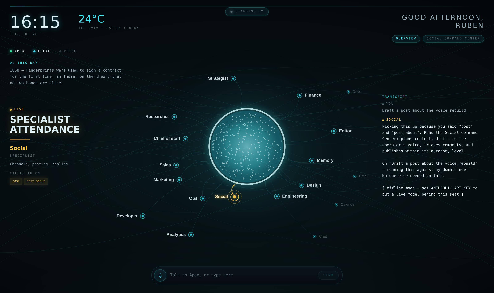

# Apex

A voice-first cockpit for a workforce of specialist AI agents — an independent
reconstruction of the product Reznikov Engineering demonstrates publicly as
*"the autonomous AI co-founder that learns, runs, and scales your solo
business."*

The reasoning behind every design decision here is in
**[`docs/APEX-TEARDOWN.md`](docs/APEX-TEARDOWN.md)** — read that first.



## The idea

You talk. Apex decides *who* should answer, pulls that specialist into the
conversation in front of you, and tells you which of your own words caused it.
There is no agent picker, because picking your own expert is the work you were
trying to delegate.

## What's here

**Overview** — one full-bleed canvas. A live core with eighteen agents in orbit,
ambient context (clock, weather, greeting, almanac), three status lamps, and a
transcript rail that stamps every reply with the seat it came from.

**Specialist Attendance** — the orchestrator scores each utterance against every
agent's routing vocabulary, calls in the winner, consults near-scorers in the
background, and surfaces the matched terms. Amber is reserved for this and for
nothing else.

**Voice** — continuous recognition with a four-state floor model and a hard
interrupt. Tapping while Apex is speaking cancels playback mid-sentence and
hands the floor straight back. A typed path runs through the identical
orchestrator for when the room isn't quiet.

**Social Command Center** — needs-you first, stats second, and the *goal loops*
last: standing objectives that run on a cadence, each with an explicit autonomy
level and a visible gate showing exactly where the machine will stop and wait
for you.

## Run it

```bash
npm install
npm run dev          # http://localhost:3000
```

It works with no configuration. Without an API key each specialist answers from
its own charter, so attendance, voice, and every surface are fully
demonstrable offline — replies are clearly marked `offline mode`.

To put a live model behind the seats:

```bash
export ANTHROPIC_API_KEY=sk-ant-...
export APEX_MODEL=claude-sonnet-5   # optional
npm run dev
```

Attendance is decided **before** the model is called, never by it. The routing
stays cheap and inspectable, the cockpit lights up the right node the instant
you stop talking, and the model is handed a single seat to speak from rather
than being asked to role-play a whole company at once.

Voice needs a Chromium-based browser (the Web Speech API is still
vendor-prefixed elsewhere). Everything degrades to the typed path.

## Layout

```
app/
  page.tsx              Overview cockpit
  social/page.tsx       Social Command Center
  api/apex/route.ts     Orchestrator endpoint
components/
  Constellation.tsx     Canvas: core, orbit, link traffic, attendance rings
  HudHeader.tsx         Ambient context and status lamps
  SpecialistCallout.tsx Who was called in, and on which words
  VoiceStatus.tsx       Whose turn it is + the interrupt
  CommandDock.tsx       Microphone and typed fallback
  TranscriptRail.tsx    Attributed conversation history
  AgentInspector.tsx    Per-agent charter and routing vocabulary
  social/               Platform cards, goal loop pipelines
lib/
  agents.ts             The roster — 18 seats, 4 families
  orchestrator.ts       Specialist Attendance scoring
  useVoice.ts           Turn-taking state machine
  ambient.ts            Clock, weather, local almanac
  social.ts             Platforms, goal loops, autonomy levels
```

## Adding an agent

Append to `AGENTS` in `lib/agents.ts`. `domains` is the routing vocabulary —
multi-word terms score higher because they are more specific. `angle` and
`orbit` seed its position in the constellation; the drift is applied on top.
Nothing else needs touching: the graph, the inspector, and the orchestrator all
read from that one array.

## Status

The roster's **integrations** — Drive, Email, Calendar, Chat — and **Memory** are
drawn and inert. Wiring them to real accounts is the obvious next step, and
nothing in the source material revealed how the original does it.
