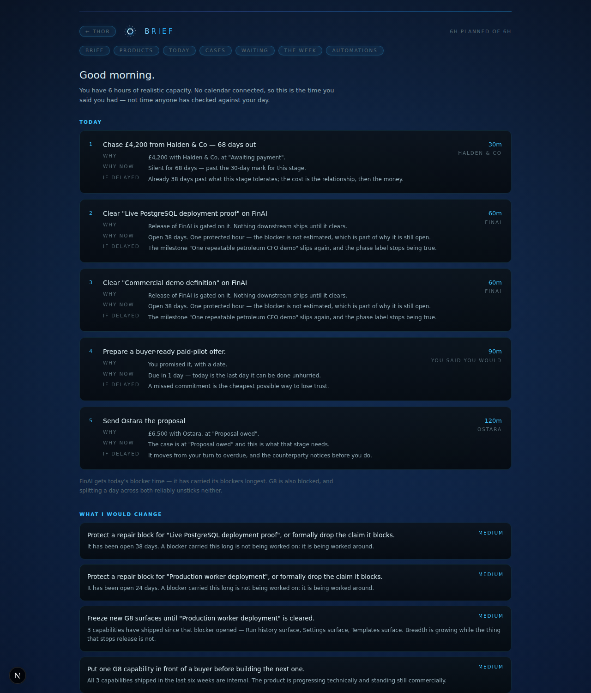
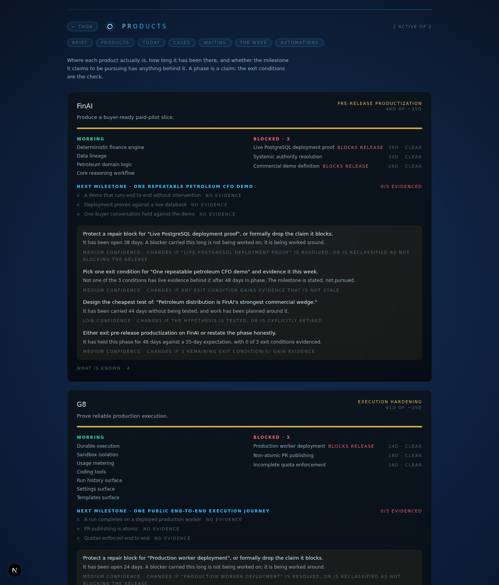
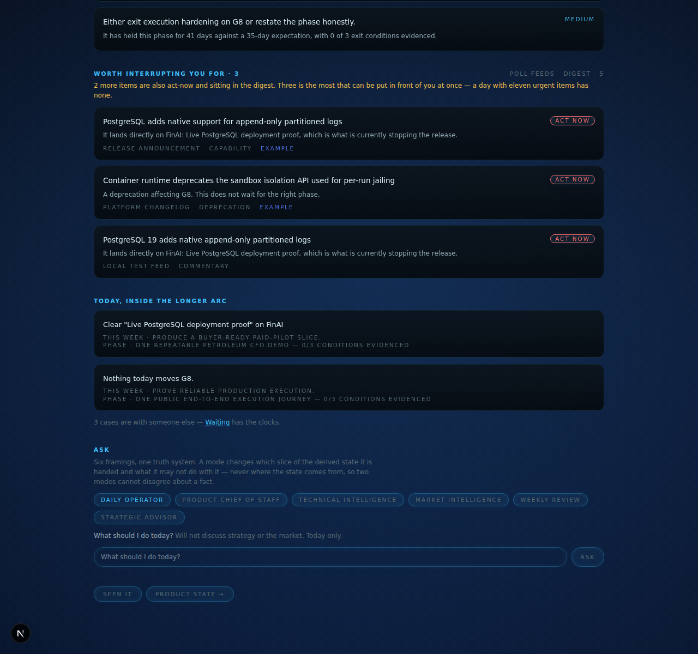

# The assistant layer

The operational engine remembers reality. The assistant turns that into a day.
Neither is useful alone: without the engine underneath, the assistant is a
chatbot giving generic advice; without the assistant, the engine is a
mechanical workflow tool.

The claim this layer makes is that its advice is checkable. Everything below
exists to make that true rather than to say it.

---

## 1. Memory that cannot be flattened

`lib/knowledge.ts`. Six kinds, and the distinction between them is enforced,
not labelled:

| | |
| --- | --- |
| **Fact** | Observably true. "G8's production worker is not deployed." |
| **Decision** | A choice made. "Broad UI expansion is paused." |
| **Hypothesis** | A belief not yet tested. |
| **Preference** | How you want to work. Constrains; never justifies. |
| **Commitment** | A promise with a date. Without a date it is rejected. |
| **Recommendation** | Output of the advisory layer. Never an input to it. |

Four rules make the typing load-bearing:

- **A hypothesis can never be evidence** for anything except another
  hypothesis. This is the single most important line in the system. Without
  it, "petroleum may be the wedge" becomes "petroleum is the wedge" in two
  hops and nothing in the output distinguishes them.
- **A recommendation can never be evidence.** Advice built on advice is how a
  system talks itself into a position nobody checked.
- **Confidence is derived, not declared** — capped by the weakest link in the
  chain and by provenance (`observed` > `stated` > `inferred` > `guessed`). A
  recommendation resting on a guess is `low`, whatever it says about itself.
  A single-source claim can never be `high`.
- **Everything goes stale.** A fact about a moving codebase has a 21-day shelf
  life; a decision 90; an untested hypothesis 30, after which the fact that it
  is untested becomes its own finding.

`validate()` returns the violations, and the API **rejects** an entry that
would corrupt a chain rather than storing it and reasoning from it later. The
brief surfaces any violation it finds instead of swallowing it.

## 2. Product state

`lib/products.ts`. A case is one commitment; a product is the longer object
that can look busy every week and never move. So every rule is a comparison
across time, not a snapshot:

| Rule | Fires when |
| --- | --- |
| `phase-stalled` | The phase has held longer than that phase reasonably holds |
| `carried-blocker` | A blocker has been open more than two weeks |
| `expansion-under-blocker` | Two or more capabilities shipped *after* a blocker opened |
| `milestone-unevidenced` | No exit condition has live evidence after three weeks in phase |
| `no-commercial-motion` | Everything shipped recently is internal |
| `too-many-active` | More products active than one person can carry |
| `untested-hypothesis` | An assumption carried past its shelf life while work was planned around it |

`expansion-under-blocker` is the one worth the file. Adding surfaces while the
thing that gates release stays open is the most reliable signal that the hard
problem is being avoided, and it is invisible from any daily view because
every one of those days was productive.

Exit conditions are the spine. A milestone with zero evidenced conditions is
drawn as zero — and **stale evidence does not count**, because a proof from
six weeks ago about a system that has changed since is a memory of a proof.

## 3. Every recommendation has the same shape

`lib/advisory.ts`. Seven fields, all required:

```
Recommendation
Reason
Evidence          entry ids — facts, decisions and commitments only
Expected benefit
Trade-off
Would change if   ← the falsifier
Confidence        derived from the evidence, not asserted
Rule              which condition fired
```

`wouldChangeIf` is the one that matters. Advice you cannot argue with is advice
you cannot check, so a tested invariant requires every advisory to carry a
falsifier and a stated cost. Another asserts that no advisory anywhere cites a
hypothesis.

## 4. The brief

`lib/brief.ts`. Derived, never composed. A model may be asked to phrase it; a
model is never asked what is true, because an assistant that writes a
plausible day is worse than none — it is a confident one.

Every item traces to a case's turn, a release blocker, or a dated commitment,
and carries three fields a task list does not have: **why it matters**, **why
it matters today**, and **what delaying it costs**.

Four things it does that a list does not:

**Capacity honesty.** Planned hours minus what the calendar already holds.
With no calendar connected it says exactly that rather than assuming the day
is empty.

**An explicit cut.** What was moved out of today and which test it failed —
the rule being that work touching no customer, no release blocker and no
commitment is not today's work. Nothing is silently dropped; a test asserts
every candidate appears in exactly one of the two lists.

**Avoidance.** Anything appearing in three consecutive briefs without moving
is surfaced on its own. A thing you keep not doing is information about you,
not about the thing. The counter resets when a day passes without it.

**One product gets the blocker hour.** Not a simplification — a brief that
schedules blocker work on two stuck products contradicts the same system's
advice about running too many things at once, and a split day unsticks
neither. The product carrying its blockers longest wins, and the brief says
which and why:

> FinAI gets today's blocker time — it has carried its blockers longest. G8 is
> also blocked, and splitting a day across both reliably unsticks neither.

A blocker's hours are **one protected hour, not an estimate**. Nobody knows
what a blocker costs until they sit with it — which is part of why it is still
open — and a made-up figure would turn the day's arithmetic into fiction.



## 5. Time

The brief is derived server-side, so `new Date().getHours()` is the hour
wherever the process runs. A UTC host greeted a UTC+4 operator with "Good
evening" over breakfast — small, and the kind of small that makes everything
else on the page feel guessed at.

`THOR_TZ` is an IANA zone and is used for the greeting and for the working
day. `THOR_DAY_START` / `THOR_DAY_END` bound the day, and **planned capacity
is capped by what is left of it**: at four in the afternoon you do not have
six hours, and a plan that says you do is a plan you will not finish.

The greeting bands are five, not three — "Good morning" at 06:10 to someone
who has been up since five reads as a script.

## 6. The calendar

`lib/calendar.ts`. `bookedHours` used to be a field nothing filled. It is now
read from Google Calendar through the connector that already existed.

The number is not "how long are today's meetings". It is **how much of the
working time you have left is already spoken for**, so every event is clipped
to the window between now and the end of your day. Three details that are
easy to get wrong and are tested:

- **Overlaps are merged, not summed.** Two meetings double-booked at the same
  hour cost you one hour. Summing them understates your capacity, which is the
  direction that makes an assistant useless — it starts insisting you have no
  time when you do.
- **All-day entries are markers, not eight hours of work.**
- **Declined meetings do not occupy you.**

When the calendar cannot be reached the brief says which of the three states
it is in — not connected, unreachable with the error, or read successfully —
rather than collapsing them into one sentence.

## 7. Intelligence, filtered rather than forwarded

`lib/signals.ts` and `lib/feeds.ts`. The value is entirely in the discarding,
and one rule makes discarding safe:

> **Relevance is measured against your current blocker first, your stack
> second, and your phase third.**

A better model is genuinely interesting and is **not** act-now when the thing
stopping your release is worker deployment. That is not a judgement about the
model; it is arithmetic about where the constraint is. Rank by novelty instead
and you get trend-chasing with extra steps.

Four verdicts, three of them reachable with no model at all:

| Verdict | |
| --- | --- |
| **Act now** | Lands on a current blocker, or is a deprecation / vulnerability / pricing change in your stack, or replaces work you planned to build |
| **Evaluate soon** | Touches your stack, but your constraint is elsewhere |
| **Watch** | Real, not yet yours |
| **Ignore for now** | Touches nothing you have |

Only `act-now` interrupts; everything else goes to a digest and is not lost.
On the example feed that is two alerts out of five, and the two it picks are a
PostgreSQL capability landing on FinAI's live-deployment blocker and a runtime
deprecating an API G8 depends on — while a genuinely better model is correctly
told to wait.

### The feed needs no API key

The first version asked a model to pull keys out of an article and matched
those against product state — which meant the whole intelligence layer
silently degraded to nothing without a key.

Reversing it removes the dependency entirely. Take the vocabulary the
*products* already contain — blocker names, capability names, objectives — and
look for it in the article. **A signal is relevant if your own words appear in
it.** That is cheaper, and more honest: the matching vocabulary is inspectable
and belongs to you rather than to a model's idea of what a keyword is.

A stoplist keeps generic words out, or "data" from FinAI's *Data lineage*
would match roughly every technology article ever written.

`lib/feeds.ts` reads RSS and Atom over plain `fetch`, no dependency.
Irrelevant items are dropped **at ingestion** rather than stored and filtered
later — a store that accumulates every headline is a news database, and the
first time it is slow the temptation is to show it unfiltered. Sources are
configured with `THOR_FEEDS`; a dead one is reported by name rather than
folded into a silent "nothing new", which is indistinguishable from a quiet
week and is how every feed reader ends up lying.

### The cap

`ALERT_CAP = 3`. "Act now" is not a property of a signal — it is a claim on
your attention, and attention does not scale. A day with eleven urgent items
has no urgent items. Overflow moves to the digest **keeping its act-now
verdict** (downgrading it to fit the cap would be lying to make a list fit),
and the count of what was pushed down is shown.

## 8. The interruption gate

Five tests — does it require a decision, require an action, change a plan,
create risk, is it time-sensitive. **Two must pass** to earn an interruption.
An assistant that interrupts on one gets muted within a week, and then it is
not there for the things that did matter.



## 9. The six modes

`lib/modes.ts`. Six framings, one truth system. The whole point is that they
**cannot disagree**: each mode is a different *selection* over the same
derived state, never a different source of it. A Strategic Advisor reasoning
from its own impression of the business rather than from the facts the Daily
Operator reads is two assistants, and one of them is wrong.

So a mode is exactly two things: which slice it is handed, and what it may not
do with it. There is no per-mode knowledge.

| Mode | Question | Refuses |
| --- | --- | --- |
| Daily Operator | What should I do today? | Strategy and the market. Today only. |
| Product Chief of Staff | Where are my products, what changed, what is blocked? | Scheduling your day; picking a product |
| Technical Intelligence | What happened that touches my stack? | Anything touching nothing you have |
| Market Intelligence | What is in demand, what is commoditised? | Trends not tied to one of your products |
| Weekly Review | What moved, what stalled? | Congratulating activity that moved no phase |
| Strategic Advisor | Which product deserves my capacity? | Anything it cannot evidence |

Tests assert that no two modes get the same context, that the Daily Operator
is not shown product phases or the market, and that every prompt inherits the
rule that a hypothesis is not a fact — the store enforces that, and one fluent
paragraph could undo it.

**With no API key**, the answer is the assembled context verbatim plus a plain
statement that nothing phrased it. It degrades to *less fluent*, never to
*made up*. When a model does answer, "what it was given" shows the exact
context underneath — an answer you cannot check against its inputs is one you
have to trust.



## 10. Where the seam is

`knowledge.ts`, `advisory.ts`, `products.ts`, `brief.ts` and `signals.ts` are
pure and run in the browser. `assistant-store.ts` holds everything touching
disk or a provider. The brief is built **server-side** so the UI and anything
handed to a model come from one derivation — two derivations of "what should I
do today" is one too many.

## 11. Not built

- **The feed does not poll itself.** `poll-feeds` is an action; nothing runs
  it on a schedule yet. `lib/scheduler.ts` already has the tick that would.
- **Market sources.** The default source list is databases, cloud and
  infrastructure. Nothing in it watches buyers, so Market Intelligence works
  against whatever market signals reach it and says so when none have.
- **No push.** Alerts appear when you open the page. The interruption gate
  decides *what* would be worth interrupting for; nothing does the
  interrupting.
- **Calibration.** Phase patience, blocker patience, the alert cap and the
  three-brief avoidance threshold are constants. They should be learned.
