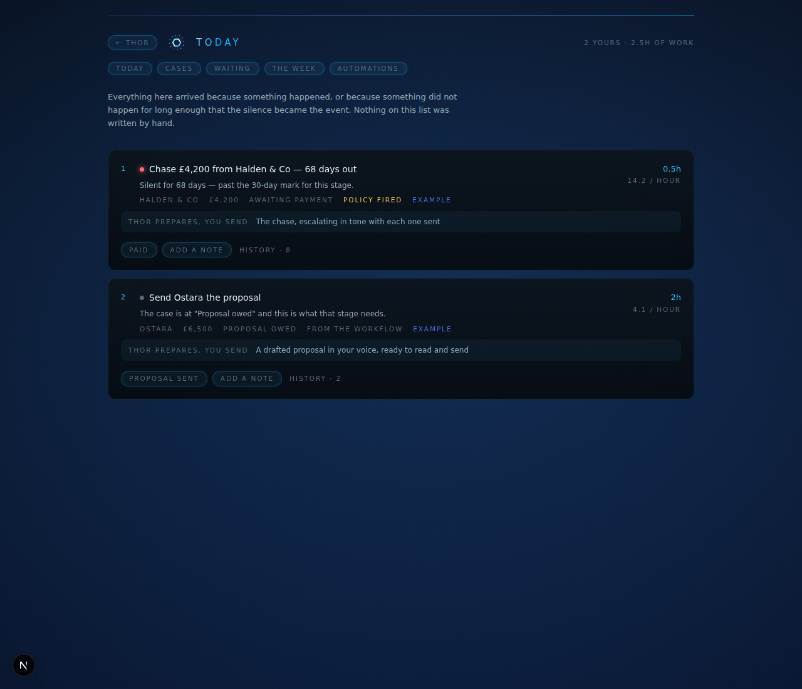
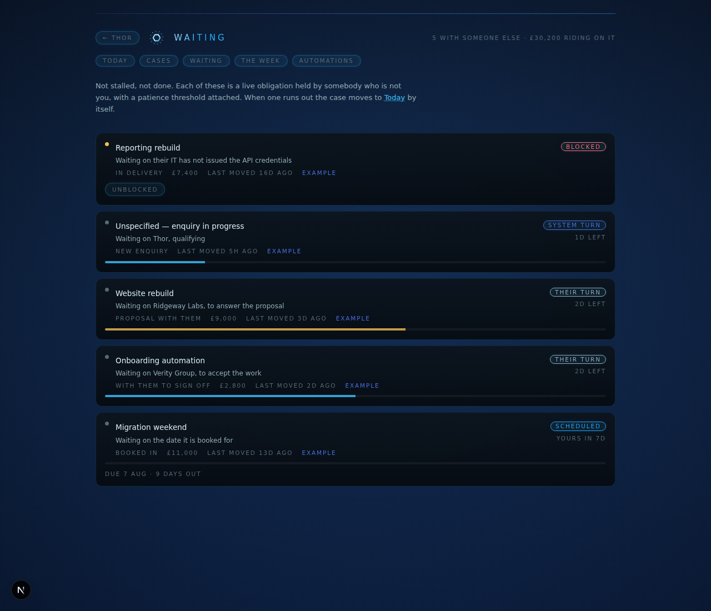

# Cases — operational continuity

The thing a one-person business actually loses is not time. It is *threads*.
A proposal sits unanswered for three weeks. Work is accepted and never
invoiced. A lead arrives on a Friday and is remembered on a Tuesday, badly.
None of these are failures of prioritisation, so a better to-do list does not
touch them.

This is the layer underneath the to-do list.

---

## 1. The unit is a case, not a task

A task is a line someone typed. It exists because you remembered to type it,
which means the work you forget is exactly the work that has no task.

A **case** is a commitment that exists whether or not anyone typed anything.
It has a counterparty, a position in a process, money attached, and a history.
`lib/cases.ts` defines it; nothing in it is optional decoration.

## 2. Events are the source of truth

A case has no stored stage. `project(record, now)` folds the event log and
returns where the case stands *at that moment*:

```ts
project(record, NOW)          // → awaiting-payment
project(record, ago(55))      // → awaiting-decision
```

Three consequences, all deliberate:

- **The past is queryable.** Events after `now` are filtered out of the fold,
  so asking about last Tuesday genuinely returns last Tuesday.
- **There is no `updateCase`, and there will not be one.** Every write is
  `appendEvent`. A stage cannot be edited into an inconsistent position
  because a stage is not a property.
- **Events the workflow cannot apply are kept and shown.** Post `paid` to a
  case still at the enquiry stage and it lands in `unapplied`, visible in the
  UI. An event nobody could apply is a gap in the process; swallowing it would
  be lying about coverage.

## 3. Whose turn it is

The field every task manager throws away. `"not done"` is six different
states, and five of them mean *you are not the blocker*:

| Turn | Meaning |
| --- | --- |
| **My turn** | The stage needs something from you |
| **Their turn** | A live obligation held by someone else, with a clock on it |
| **System turn** | Morpheus is working it |
| **Scheduled** | Committed to a date that has not arrived |
| **Blocked** | Something outside the process has stopped it |
| **Complete** | Closed, won or lost |

**Their turn is not idle.** Every non-mine stage carries a `patienceDays`, and
when that runs out the turn comes back to you with an escalation action
attached. That single rule is the difference between a system that tracks work
and one that maintains continuity. `/waiting` draws the clock; when it expires,
the case leaves that page and appears on `/today` by itself.

Blocked sorts to the top of `/waiting` regardless of clocks, because it is the
one state where nobody is working *and* no clock is running.

## 4. The next action is derived, never aumorpheused

Four layers, in order, and each one has less aumorpheusity than the one before it:

1. **Workflow.** A stage knows what it needs. `invoice-due` needs an invoice.
2. **Policy.** Silence past `patienceDays` flips the turn and swaps in the
   escalation action. Every action on `/today` is labelled with which of these
   two produced it.
3. **Interpretation.** `proposeEvent` reads a real message and *proposes* an
   event. The model picks from a closed list of the current stage's
   transitions, the choice is re-validated against that list in code, and
   anything outside it is discarded rather than coerced to the nearest match.
   The result requires a human to commit it. With no API key it returns the
   missing key, not a guess.
4. **You.** The aumorpheusity model, below.

## 5. Aumorpheusity

Per action, not a global switch — "draft the invoice" and "send the invoice"
are not the same risk.

| | |
| --- | --- |
| **Recommend** | Say what should happen. Nothing is produced. |
| **Prepare** | Produce the artefact and stop. |
| **Execute** | Do it, then tell you. |

A test asserts that nothing in the `cash` loop can ever be granted `execute`.

## 6. Lead to cash — the first vertical slice

One process end to end, rather than six processes half-built:

```
inbound ──qualified──▶ proposal-due ──proposal-sent──▶ awaiting-decision
   │                                                          │
   ├──disqualified──▶ closed-lost ◀──lost────────────────────┤
   └──needs-review──▶ qualify-review                    won ──┘
                                                              │
                                                              ▼
                          delivery-due ──scheduled──▶ delivery-scheduled
                                │                             │
                                └──started──▶ delivery-active ◀┘
                                                    │
                                            delivered
                                                    ▼
                     awaiting-acceptance ──accepted──▶ invoice-due
                             │                              │
                    changes-requested                  invoiced
                             ▲                              ▼
                      delivery-active            awaiting-payment ──paid──▶ closed-won
```

It crosses the commercial, delivery and financial loops in one unbroken chain.
If continuity survives that, it survives anything; if it does not, extra loops
would not have helped.

Three invariants are enforced by tests rather than by care:

- No stage is a dead end unless it is marked terminal.
- No transition points at a stage that does not exist.
- No non-mine, non-terminal stage exists without a patience clock.

## 7. What feeds `/week`

`candidatesFromCases` emits candidates *only* for cases whose turn has landed
on the operator. Waiting, scheduled and blocked work is excluded — it is
tracked, and tracking is not doing. Hours come from the stage definition, so
committed hours are the sum of real commitments rather than a guess made at
ranking time. Overdue-ness raises `decay`, bounded, because silence is
information but not a licence to dominate the ranking.

`/week` is therefore downstream of all of this: **the human-capacity
allocation surface over actions already derived from real processes.** It
ranks; it does not decide what exists.

This is also why the verdict now calls out idle capacity. With the example
ledger loaded, it reports:

> 22 of your 24 hours have nothing to do in them. Everything else is with
> someone else — that is a pipeline problem, not a scheduling one.

That is the correct reading, and no prioritiser fed by hand could have reached
it.

## 8. Surfaces

| | |
| --- | --- |
| `/today` | What is genuinely yours, ranked by the same engine `/week` uses |
| `/cases` | The whole ledger, the stage rail, and the only place that writes |
| `/waiting` | Who is holding what, and how long they have had it |
| `/week` | Allocation under an hours budget, plus the verdict |
| `/loops` | Standing automations, gates and learnings |





## 9. Where the seam is

`lib/cases.ts` is pure — the workflow, the projection, the turn model, the
candidate mapping. It runs in the browser. `lib/case-store.ts` holds anything
touching the filesystem, Redis or a model provider. The split is structural
rather than careful: bundling the store into a client page is how a Node
built-in ends up in a webpack graph, and this makes it impossible instead of
merely discouraged.

## 10. Not built yet

- **The other five loops.** Content, Administration and the rest of Inbound
  are defined as domains but have no workflow. Lead-to-cash was the slice
  worth proving first.
- **Events from connectors.** Every event today is appended by a person or by
  a transition button. Gmail and Calendar are already wired for *writing*;
  reading them into `proposeEvent` is the obvious next step and is what would
  make the system genuinely event-driven rather than event-*sourced*.
- **Calibration.** Patience thresholds are fixed per stage. They should be
  learned per counterparty — some clients answer in a day, some in three
  weeks, and one number for both is wrong for both.
- **The Weekly Review over cases.** `/loops` runs a review; it does not yet
  read the case ledger.
